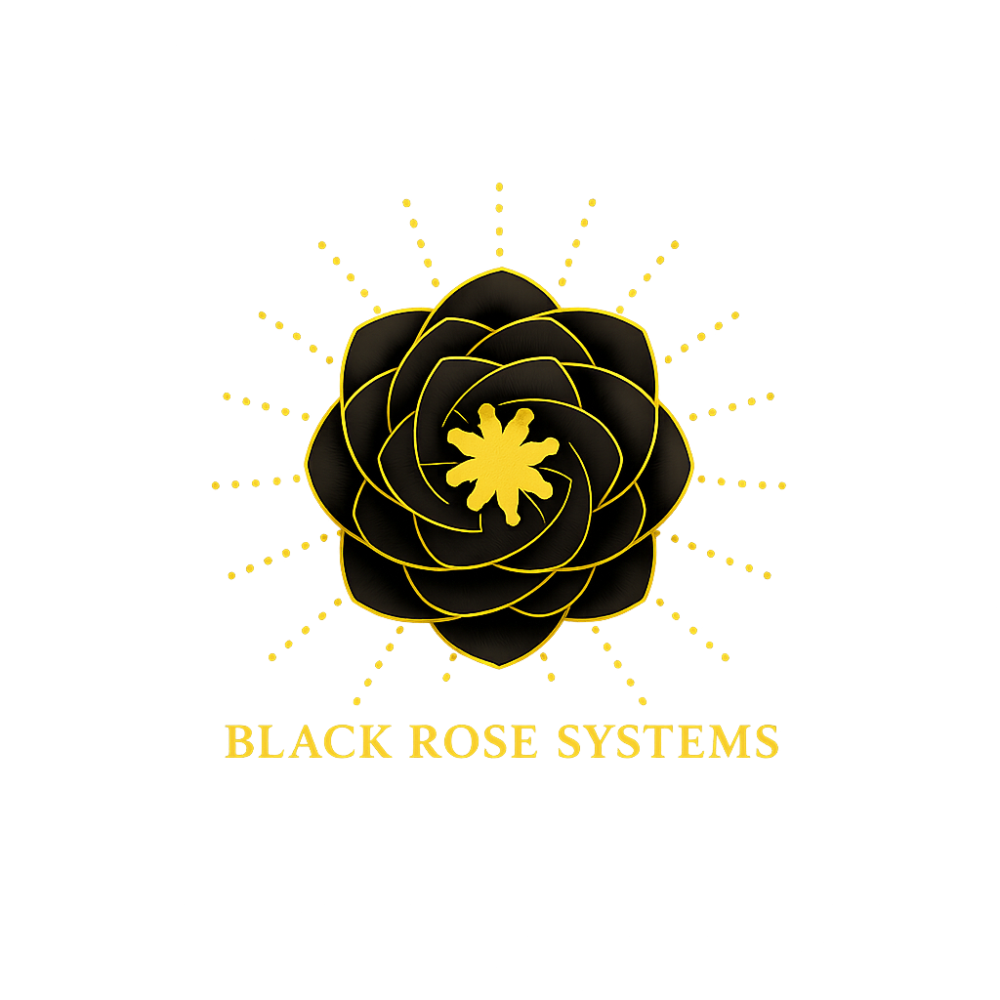

<div align="center">
  
  <h1>MUNIFY</h1>
  <p><strong>Sistema de Registro Civil Municipal</strong></p>
</div>

---

## Acerca de Munify

**MUNIFY** es una plataforma integral desarrollada para modernizar y agilizar los servicios de registro civil de la Alcaldía Municipal. El sistema permite gestionar los documentos de identidad y trámites civiles de los ciudadanos con un proceso rápido, 100% seguro y sin necesidad de realizar largas filas. 

<div align="center">
  
</div>

---

## Características y Servicios

La plataforma ofrece a los ciudadanos una atención ágil y verificada, incluyendo los siguientes servicios y trámites:

- **Partida de Nacimiento**: Primera emisión y copias certificadas del acta de nacimiento.
- **Carnet de Minoridad**: Identificación oficial para menores de 18 años.
- **Acta de Defunción**: Certificado legal de fallecimiento y lugar de inscripción.
- **Acta de Matrimonio**: Registro y certificación de matrimonios civiles.
- **Testamentos**: Registro y resguardo de la voluntad del testador con respaldo legal.

Además, el sistema incluye:
- Panel de control o **Dashboard** para secretarios/administradores de la alcaldía.
- Sistema de **Solicitud de Citas** para facilitar la recepción y entrega de trámites para los ciudadanos.
- Generación de reportes PDF y envío automático de comprobantes por correo electrónico.

---

## Tecnologías Utilizadas

- **Frontend:** HTML5, CSS3, Vanilla JavaScript, Bootstrap 5.
- **Backend:** PHP 8+ (Arquitectura MVC).
- **Base de Datos:** MySQL.
- **Librerías / Dependencias:** 
  - [Composer](https://getcomposer.org/) para el manejo de dependencias.
  - [DomPDF](https://github.com/dompdf/dompdf) para la creación de reportes y certificaciones en PDF.
  - [PHPMailer](https://github.com/PHPMailer/PHPMailer) para notificaciones y recuperación de contraseñas.
  - [SweetAlert2](https://sweetalert2.github.io/) para alertas y modales interactivos.
  - [FontAwesome](https://fontawesome.com/) para iconografía.

---

## Requisitos de Instalación

1. Servidor web local como XAMPP, WAMPP o Laragon.
2. PHP 8.0 o superior.
3. Composer instalado en el sistema.
4. Servidor de base de datos MySQL / MariaDB.

---

## Guía de Configuración

1. **Clonar o descargar** el proyecto dentro de tu directorio público (`htdocs` en XAMPP o `www` en WAMP).
2. **Instalar dependencias**:
   Abre una terminal en la raíz del proyecto (`Munify`) y ejecuta el siguiente comando:
   ```bash
   composer install
   ```
3. **Configurar la Base de Datos**:
   - Crea una base de datos en MySQL (ej: `munify_db`).
   - Importa la estructura de las tablas usando el script SQL o ejecutando los scripts de creación de la base de datos disponibles en el proyecto.
   - Configura las credenciales de conexión en los archivos ubicados en la carpeta `config`.
4. **Configuración de Correo Electrónico**:
   Revisa el archivo `GUIA_CONFIGURACION_CORREO.txt` para establecer las credenciales SMTP necesarias para el funcionamiento del sistema de notificaciones.
5. **Ejecutar la aplicación**:
   Abre en tu navegador la ruta correspondiente a tu servidor local, por ejemplo:
   ```text
   http://localhost/Munify
   ```

---

## Desarrollado por
<br>

<div align="left" style="display: flex; align-items: center; gap: 15px;">
  
  <div>
    <h3 style="margin: 0;">BlackRose Systems</h3>
    <p style="margin: 5px 0 0 0; color: #555;">Agencia de Ingeniería y Soluciones de Software</p>
    <p style="margin: 5px 0 0 0; font-style: italic; color: #777;">"Transformando ideas en código"</p>
  </div>
</div>
